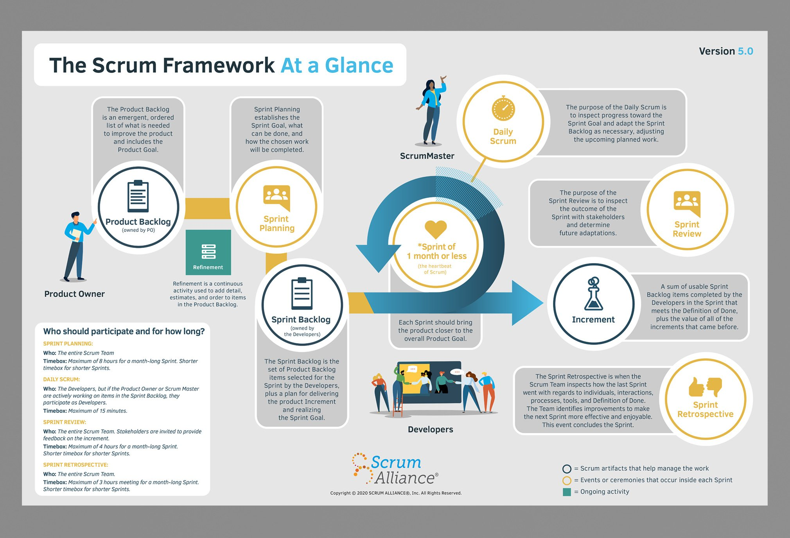

# Week 1 Revision Notes

## Agile & Scrum

### What are the Agile values?

1. Individuals and interactions over processes and tools

<table>
  <tr>
    <td></td>
    <td></td>
  </tr>
</table>

2. Working software over comprehensive documentation

<table>
  <tr>
    <td></td>
    <td></td>
  </tr>    
</table>

3. customer collaboration over contract negotiation

<table>
  <tr>
    <td></td>
    <td></td>
  </tr>
</table>

4. Responding to change over following a plan

<table>
  <tr>
    <td></td>
    <td></td>
  </tr>
</table>

<aside>
💡 4 Values - “Two eyes work in collaboration to see change.”

</aside>

<br>


### What are the Agile principles?

1. Customer satisfaction through early and continuous delivery of valuable software is the highest priority.
2. Welcome changing requirements.
3. Deliver frequently.
4. Business people and developers work together throughout the project.
5. Give motivated individuals the environment and support they need, and trust them to get the job done.
6. Face-to-face conversation is the most efficient and effective method of communication.
7. Working software is the primary measure of progress.
8. Agile processes promote sustainable development.
9. Continuous attention to technical excellence and good design enhances agility.
10. Simplicity - the art of maximising the amount of work not done - is essential. .
11. The best architectures, requirements and designs emerge from self-organising teams.
12. The team regularly reflects on how to become more effective, then tunes and adjusts accordingly.

<aside>
💡 Don’t try to memorise all of the principles. Just focus on one or two that you think are important and be prepared to explain *why* they are important.

</aside>

<br>

### What is your favourite Agile principle?  Describe it.

My favourite Agile principle is:

> "Build projects around motivated individuals. Give them the environment and support they need, and trust them to get the job done."
>

This principle highlights the importance of empowering individuals. When teams are given the freedom to work on projects that they are passionate about, they are more likely to be motivated and produce better results. Also, when team members are given the necessary support, resources, and tools, they can perform their work with more efficiency and effectiveness.

The principle also recognises that micromanaging team members can be counterproductive and result in low morale. When teams are trusted to work independently, they have more ownership over their work and feel more accountable for their outcomes. This sense of responsibility can lead to increased collaboration, communication, and innovation within the team.

Overall, the principle emphasizes the importance of creating a positive work environment where individuals feel empowered, supported, and trusted. By building projects around motivated individuals, organizations can foster a culture of excellence and encourage team members to take ownership of their work, resulting in greater satisfaction and productivity.

<br>

### What is an Agile ceremony?

An Agile ceremony is a scheduled meeting or event that serves a specific purpose in the Agile development process. Agile ceremonies are designed to help team members collaborate effectively, stay focused on project goals, and continuously improve their processes and practices.

<br>

### What is the most popular Agile method?

The most popular Agile method used in software development contexts is Scrum.

<br>



<br>

### What are the Scrum ceremonies?

The main Scrum ceremonies, or events, are:

1. Sprint Planning: A meeting at the beginning of each sprint where the team discusses the product backlog items and creates a plan for the upcoming sprint.
2. Daily Scrum: A 15-minute daily meeting where the team members synchronize their work and plan for the day ahead.
3. Sprint Review: A meeting at the end of each sprint where the team presents the completed work (the increment) to stakeholders and receives feedback.
4. Sprint Retrospective: A meeting at the end of each sprint where the team reflects on their performance and identifies areas for improvement.

In addition to these main ceremonies, some teams might also include the following ceremonies:

1. Backlog Refinement/Grooming: A meeting where the team reviews the product backlog and adds more detail or refines the items.
2. Release Planning: A meeting where the team plans the release of the product by identifying the backlog items that will be delivered in each release.
3. Sprint Goal Setting: A meeting where the team sets a goal for the upcoming sprint based on the product backlog items.

<br>

### What are the Scrum artefacts?

In Scrum, artefacts are tangible deliverables or documentation that are used to provide transparency and visibility into the progress of the project. The three Scrum artefacts are:

1. Product Backlog: A prioritized list of all the features, requirements, enhancements, and bug fixes that the team needs to work on to deliver the product. The Product Backlog is maintained and owned by the Product Owner, who is responsible for ensuring that it is up-to-date and reflects the current priorities of the project.
2. Sprint Backlog: A list of the items from the Product Backlog that the team commits to delivering in the upcoming Sprint. The Sprint Backlog is created by the Development Team during the Sprint Planning meeting and is updated daily during the Daily Scrum.
3. Increment: The sum of all the Product Backlog items completed during the Sprint and the value of the increments from previous Sprints. The Increment is the sum of all the completed and potentially releasable Product Backlog items that the Development Team has delivered during the Sprint. It represents the progress made by the team and is an important measure of the team's productivity.

<br>

### What is a sprint?

A sprint is a time-boxed iteration during which the Development Team works to deliver a valuable increment of the product.

All the work necessary to achieve the Product Goal, including Sprint Planning, Daily Scrums, Sprint Review, and Sprint Retrospective, happen within Sprints.

<br>

### What is a Scrum Master?

The Scrum Master:

1. Facilitates the Scrum process.
2. Organises the scrum ceremonies, or events
3. Ensures that the team understands and follows the Scrum framework.
4. Identifies and removes impediments that might prevent the team from reaching the Product Goal.

<br>

### What are personas?

A user persona is a fictional representation of a typical user or a product or service. A user persona is often modelled by a team to help them understand the needs, goals, behaviours and motivations of their users.

<br>

### What makes a good user story?

A good user story should be user-centric and meet the six criteria summarised by the acronym INVEST, that is they should be:

- Independent - not reliant on the results of other user stories, this allows flexibility in terms of backlog prioritisation.
- Negotiable - user stories can be modified over time according to changing requirements.
- Valuable - stories should be written so that the benefits to the customer or users are obvious. The story should address a real need or problem and justify the development effort required to complete the story.
- Estimable - the team should be able to estimate the effort required to complete the story.
- Small - user stories should be small enough to complete in a single sprint.
- Testable - the team should be able to write acceptance criteria and test that the delivered feature meets the customer or user's needs.

<br>

### What is a Gherkin script?

A _Gherkin script_ is a plain-text specification language used in _Behaviour Driven Development (BDD)_ to write software acceptance tests. It uses a syntax that is simple to read and write for both technical and non-technical stakeholders alike. Test cases, or scenarios, are described in terms of preconditions, actions, and results using specific _keywords_, namely `Given`, `And`, `When`, and `Then`. For example:

```gherkin
Scenario: Login with valid credentials
    Given I am on the login page
    When I enter valid credentials
    And click the login button
    Then I should be logged in
```

In this example, the scenario describes the behaviour of the login feature, and the steps describe the actions that the user takes to log in to the system.

Gherkin scripts can be used to generate automated tests using tools such as Cucumber, which can parse the scripts and generate executable code in a variety of programming languages.

<br>

### What is a Definition of Done?

In agile software development, a "definition of done" (DoD) is a shared understanding among the development team, product owner, and other stakeholders of the criteria that must be met before a product backlog item (PBI) is considered complete.

<br>

### What makes a good Definition of Done?

A good definition of done (DoD) is a clear and concise checklist of criteria that a product backlog item (PBI) must meet before it can be considered "done." It is an agreement between the development team, product owner, and other stakeholders on the quality standards that must be met in order to deliver a successful product increment.

A good definition of done typically includes the following characteristics:

1. Comprehensive: The DoD should cover all aspects of the product increment, including functionality, usability, performance, security, and other non-functional requirements.
2. Clear and concise: The DoD should be easy to understand and communicate, with clear and concise language that is free of ambiguity.
3. Measurable: The DoD should include measurable criteria that can be objectively verified through testing or inspection.
4. Achievable: The DoD should be achievable within the constraints of the team's resources, skills, and time.
5. Shared and agreed-upon: The DoD should be shared and agreed-upon by all stakeholders, including the development team, product owner, and other relevant parties.
6. Dynamic: The DoD should be reviewed and updated regularly to reflect changes in the product, technology, or stakeholder needs.

A good definition of done ensures that the development team delivers a high-quality product increment that meets the expectations of stakeholders and users. It also helps to foster transparency, collaboration, and continuous improvement within the team, by providing a clear understanding of what constitutes "done" for each PBI.

<br>

### What is a Definition of Ready?

A Definition of Ready (DoR) is a set of criteria that a user story or feature must meet before it is considered ready to be worked on by the development team.

<br>

### What are the advantages and disadvantages of agile methodologies?

#### Advantages:

1. Flexibility: Agile methodologies prioritise responding to change over following a rigid plan. This allows development teams to adapt to changing project requirements, market conditions, or customer needs, and to deliver working software quickly.
2. Collaboration: Agile methodologies encourage collaboration and communication among team members, which can lead to better ideas, faster problem-solving, and higher-quality software.
3. Continuous improvement: Agile methodologies are designed to promote continuous improvement and reflection, with regular feedback loops and retrospectives to identify areas for improvement and make adjustments, while adhering to the
4. Customer satisfaction: Agile methodologies focus on delivering working software quickly and frequently, which can improve customer satisfaction by giving them early and frequent opportunities to provide feedback and see progress.

#### Disadvantages:

1. Uncertainty: Agile methodologies prioritize responding to change over following a plan, which can create uncertainty and risk for stakeholders who may not be accustomed to this approach. Agile methodologies are also reluctant to impose fixed timelines or deadlines on projects.
2. Lack of structure: Agile methodologies are designed to be flexible and adaptable, which can be a disadvantage for teams who prefer a more structured approach.
3. Dependence on team members: Agile methodology relies heavily on the collaboration and communication between team members, which can be challenging if team members are unavailable or uncooperative.
4. Risk of scope creep: The willingness to accept changing requirements can increase the risk of scope creep.

<br>

## Git
### Why do we use version control for 1-person projects?

Version control allows us to track changes to our code over time, and to rollback changes if desired or necessary.

Version control also allows us to experiment with new features to see how they affect our codebase, without necessarily deploying the updated codebase to a production environment.

Version control can also serve as a form of documentation - commit messages can provide us with a form of version history for a particular project.

<br>

### What command do you use to create a local repository?

`git init`

### What command do you use to clone a remote repository?

`git clone`

<br>

### What is staging?  What command do you use to stage files?

Staging is the process of preparing changes in a working directory for committing to a Git repository. Before a file can be committed, it must first be staged*.

You can stage changes using the `git add` command. Staging a change instructs Git to include the staged changes in the next commit.

The staging area, also known as the index, is a container that holds changes that have been added to the Git repository but have not yet been committed. The staging area is used to organise changes into logical units, known as commits, and to review and modify changes before they are committed.

We can use the `git diff` command to see the differences between the working directory and the staging area, or the `git status` command to see the current status of the staging area.

<br>

### What is a commit?

A commit is a snapshot of the changes made to the files in a repository at a particular point in time. It's a way to record changes to your code and document *what* was changed, *when* it was changed, and *why* it was changed.

Once you've staged your changes, you can create a commit using the `git commit` command. This will create a new snapshot of your files, incorporating the changes you've staged.

Each commit in Git has a unique identifier, known as a hash, which allows you to refer to that specific commit in the future. When you create a commit, you can also add a commit message to document the changes that were made, by adding the `-m` modifier to the `git commit` command i.e., `git commit -m "Commit message"`

Commits in Git are organized in a historical tree-structure; each commit, besides the initial commit, points to an ancestor. By using this history, we can view the changes that were made to a file over time, revert to a previous version of the file, or merge changes made in separate branches.

<br>

### How do you save any local changes to the remote repository?

Local commits can be saved to a remote repository by using the `git push` command, followed by modifiers that point to the branch we wish to push to i.e., `git push [alias] [branch]`. For example, to push to the main branch, we can use the command `git push origin main`.

<br>

### What is a git-ignore file and why is it important?

A `.gitignore` file is a special file saved in the root directory of your Git repository that tells Git which files or directories to ignore when tracking changes in that repository. It is important because it allows us to avoid committing files that are unnecessary for the functioning of the project and add little to no value.

<br>

## PowerShell

In the command line/terminal:

<br>

### What command creates a new directory?

We can use the following commands to create a new directory:

`mkdir`

`md`

`New-Item`

<br>

### How do you move into a sub-directory and back to a parent directory?

- To change directory to a subdirectory of your current working directory, use `cd \subdirectory`or `cd .\subdirectory`
- To change directory to the parent directory of your current working directory, use `cd ..`

<br>

### How do you return to the root folder?

`cd \`

### How do you return to the user’s home directory?

`cd ~`

<br>

### How do you create a text file?

To create a new text file in a directory using Windows PowerShell, you can use the `New-Item` cmdlet with the `-ItemType` parameter set to `File` and the name of the file you want to create. For example:

```powershell
New-Item -ItemType File -Name "myfile.txt"
```

If you want to create the file in a directory other than the current working directory, you can specify the path using the `-Path` parameter, as follows:

```powershell
New-Item -ItemType File -Path "C:\mydir\myfile.txt"
```

Once you’ve created the file, you can open it using Notepad, for example:

```powershell
notepad myfile.txt
```

You can also chain the commands to create a new text file and open it in Notepad using the Windows PowerShell pipeline:

```powershell
New-Item -ItemType File -Name "C:\mydir\myfile.txt" | Invoke-Item
```

<br>

### How do you print the contents of a text file to the console?

To print the contents of a text file to the PowerShell terminal (console), you can use the `Get-Content` command e.g.,

```powershell
Get-Content myfile.txt
```

<br>

### What are some other useful commands that you learnt?

```powershell
ls              # lists the content of the current working directory
pwd             # identifies the current working directory
cd ~            # navigates to the user's home directory
cd \            # navigates to the root directory of the current working directory
cls             # clears the content of the current instance of the PowerShell terminal
Get-Command     # Get all commands
```
